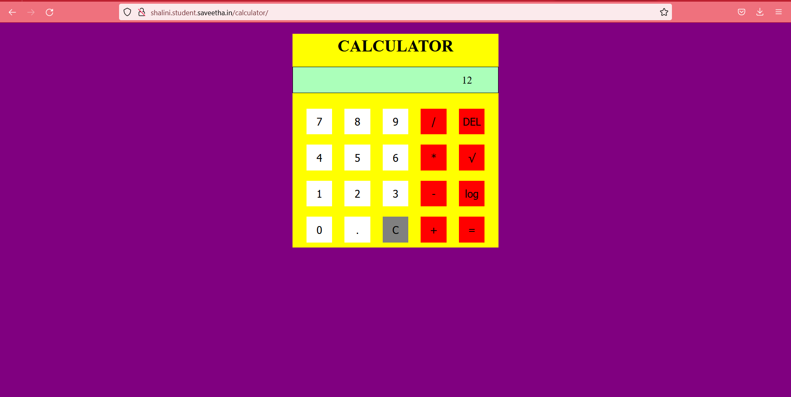
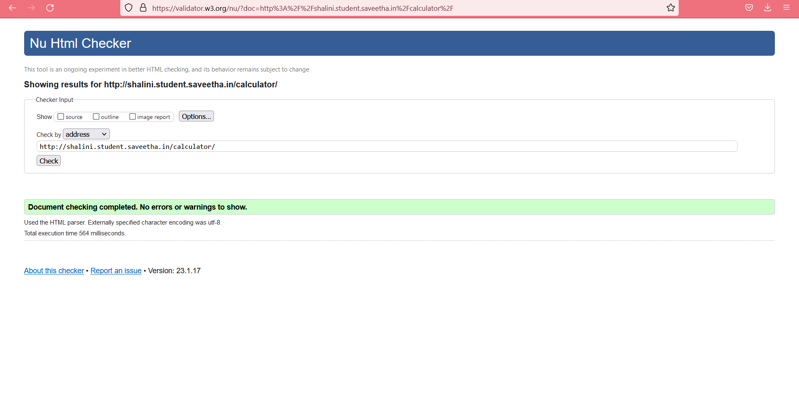

# Design of a Standard Calculator

## AIM:

To design a web application for a standard calculator.

## DESIGN STEPS:

### Step 1:

Fork and clone the repository.

### Step 2:

Create a django project "calculator" and app "calculatorapp".


### Step 3:

Define urls.py and views.py for the website .Allow host access and add the app name under installed apps.

### Step 4:

Create a templates folder under the app folder followed by a folder under templates with the app
name followed by html file named calculator.html.

### Step 5:

Run the server using the command "python3 manage.py runserver" with a port number.

### Step 6:

Validate the HTML and CSS code.

### Step 7:

Publish the website in the given URL.

## PROGRAM :

```

<!DOCTYPE html>
<HTML lang="en">
<head>
<title>Calculator</title>
<script>
function calculate(args)
{
res = document.getElementById("result");
expression = res.innerText;
cmd = args.srcElement.innerText;
if(cmd == "=")
{
expression = "" + eval(expression)
}
else if(cmd == "C")
{
expression=""
}
else if(cmd == "DEL")
{
expression = expression.slice(0, -1);
}
else if(cmd == "√")
{
expression = "" + Math.sqrt(eval(expression));
}
else if(cmd == "%")
{
expression = expression % 1;
}
else if(cmd == "log")
{
expression = Math.log10(expression);
}
else{
expression = expression + cmd;
}
res.innerText = expression;
}
</script>
<style>
h1{
color: yellow;
}
.calculator-container {
width: 400px;
background-color:yellow;
margin: 0 auto;
text-align: center;
}
button {
width: 50px;
height: 50px;
margin: 10px;
font-size: 20px;
background-color: white;
color: black;
border: none;
}
#result {
background-color:#ABFFBA;
text-align: right;
padding-right: 50px;
font-size: 20px;
margin-bottom: 20px;
border: solid black 0.5px;
color: black;
width: 348px;
height: 50px;
display: flex;
align-items: center;
justify-content: flex-end;
}
h1 {
padding-top: 5px;
color: black;
}
.redd {
background-color: grey;
}
.bluee {
background-color: red;
}
body {
background-color: purple;
}
</style>
</head>
<body>
    <div class="calculator-container">
<h1>CALCULATOR</h1>
<div id="result">0</div>
<button onclick="calculate(event);">7</button>
<button onclick="calculate(event);">8</button>
<button onclick="calculate(event);">9</button>
<button class="bluee" onclick="calculate(event);">/</button>
<button class="bluee" onclick="calculate(event);"> DEL </button><br>
<button onclick="calculate(event);">4</button>
<button onclick="calculate(event);">5</button>
<button onclick="calculate(event);">6</button>
<button class="bluee" onclick="calculate(event);">*</button>
<button class="bluee" onclick="calculate(event);">√ </button><br>
<button onclick="calculate(event);">1</button>
<button onclick="calculate(event);">2</button>
<button onclick="calculate(event);">3</button>
<button class="bluee" onclick="calculate(event);">-</button>
<button class="bluee" onclick="calculate(event);">log</button><br>
<button onclick="calculate(event);">0</button>
<button onclick="calculate(event);">.</button>
<button class="redd" onclick="calculate(event);">C</button>
<button class="bluee" onclick="calculate(event);">+</button>
<button class="bluee" onclick="calculate(event);">=</button><br>
</div>
</body>
</HTML>

```

## OUTPUT:

STANDARD CALCULATOR






## Result:

Successfully created a web page for standard calculator .

